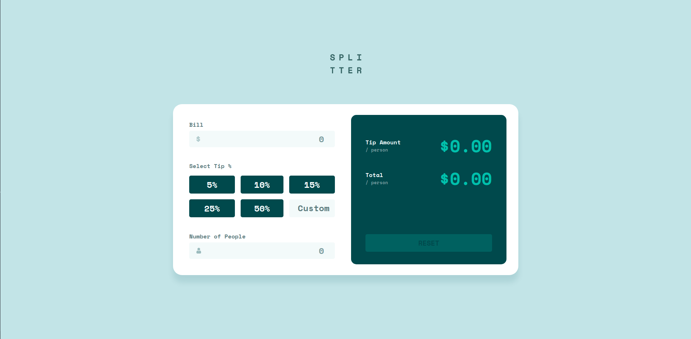

# Frontend Mentor - Tip calculator app solution

This is a solution to the [Tip calculator app challenge on Frontend Mentor](https://www.frontendmentor.io/challenges/tip-calculator-app-ugJNGbJUX). Frontend Mentor challenges help you improve your coding skills by building realistic projects.

## Table of contents

- [Overview](#overview)
  - [The challenge](#the-challenge)
  - [Screenshot](#screenshot)
  - [Links](#links)
- [My process](#my-process)
  - [Built with](#built-with)
  - [What I learned](#what-i-learned)
  - [Continued development](#continued-development)
- [Author](#author)
- [Acknowledgments](#acknowledgments)

## Overview

### The challenge

Users should be able to:

- View the optimal layout for the app depending on their device's screen size
- See hover states for all interactive elements on the page
- Calculate the correct tip and total cost of the bill per person

### Screenshot

### Links

- Solution URL: [https://www.frontendmentor.io/solutions/i-love-typescript-3-amCCzk4MH1](https://www.frontendmentor.io/solutions/i-love-typescript-3-amCCzk4MH1)
- Live Site URL: [https://wizardly-jennings-42672c.netlify.app/](https://wizardly-jennings-42672c.netlify.app/)

## My process

### Built with

- Semantic HTML5 markup
- SCSS
- Flexbox
- Mobile-first workflow
- [jest](https://jestjs.io/) -- for testing
- [babel](https://babeljs.io/)
- [TypeScript](https://www.typescriptlang.org/) -- for app logic
- [WebPack](https://webpack.js.org/) -- for bundle all files for production

### What I learned

WebPack setup with TypeScript bubel and TypeScript support

### Continued development

I want to focus on improve my html + scss + js skills and than I want to complete these challenges using vue :)

## Author

- Github - [Mikołaj Szymczuk](https://github.com/mikolajszymczuk1)
- Frontend Mentor - [@mikolajszymczuk1](https://www.frontendmentor.io/profile/mikolajszymczuk1)

## Acknowledgments

LOVE TypeScript <3